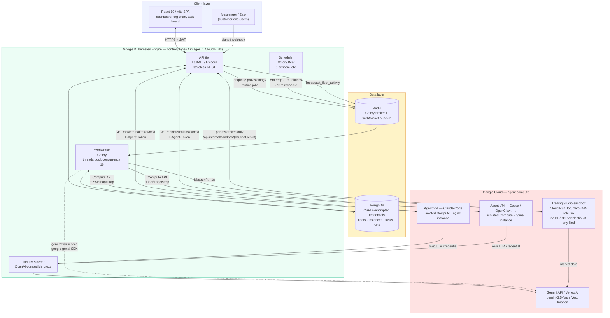
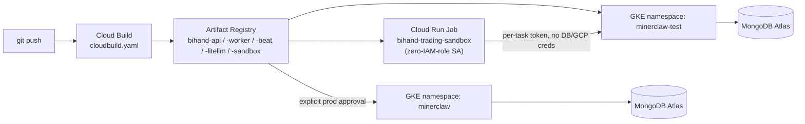

# Architecture

Bihand is a stateless, event-driven control plane: a FastAPI REST API and a Celery
worker/beat pair, coordinating over MongoDB and Redis, that provisions and supervises
fleets of autonomous AI agents running as isolated GCP Compute VMs. Agents never talk to
the browser or to each other directly — every interaction is mediated through the API,
so the database is always the single source of truth for what an agent is doing and why.

## System diagram

## The three loops that matter

**1. Fleet provisioning (human → agent, cold start).**
A user designs an org chart in the wizard and submits it. The API validates the request
and enqueues a job on Redis; a Celery worker calls the GCP Compute API to create one VM
per agent, injects a bootstrap script via VM metadata (the `services/provisioning/*`
strategy for that agent's runtime — Claude Code, Codex, OpenClaw, OpenCode, Hermes, or
NemoClaw), and writes the encrypted connection details back to MongoDB. The VM installs
its agent runtime, mints its own dashboard token, and starts polling.

**2. Task execution (agent ⇄ agent, steady state).**
An agent VM calls `GET /api/internal/tasks/next` with its `X-Agent-Token`, which the API
resolves against the `dashboardToken` stored on its `instances` document — no user
credential is ever present on the VM. The agent works the task using its *own* LLM
credential (BYOK, resolved from `credentialController` at provisioning time, or the
built-in `bihand`-provider path that routes through the LiteLLM sidecar to Gemini — this
OSS build has no credit/billing gate, so that path is unmetered rather than deducted from
a purchased balance), then reports back via `PATCH /api/internal/tasks/{id}/status`.
Every status change fans out over the Redis-backed WebSocket layer, so the dashboard
updates live without polling.

**3. Customer support (external event → agent, asynchronous).**
An inbound Messenger/Zalo message hits a public, signature-verified webhook
(`channelWebhookController`). It's attached to a durable `Conversation` /
`CustomerProfile` record, debounced, and handed to an agent for a drafted or
auto-sent reply depending on the flow's policy — the same "durable state + async
agent action" shape as the task loop, applied to real-time external messages instead of
an internal task board.

## Deployment topology

One repo, five Dockerfiles (`Dockerfile.api`, `.worker`, `.beat`, `.litellm`,
`.sandbox`), one `cloudbuild.yaml` that builds and pushes all five on every deploy.
Locally, the four API/worker/beat/litellm processes run from a single
`docker-compose.test.yml` (plus a bundled `mongo` and `redis` container, so local dev
needs no cloud account at all) — the only thing that changes between "run it on my
laptop" and "run it on GKE" is where `MONGODB_URI` and `REDIS_URL` point. The fifth
image, `Dockerfile.sandbox`, doesn't run in GKE at all — see below.

## Security model at a glance

- **Three separate auth schemes, none of them shared**: JWT for human dashboard
  sessions (default sign-in is email/password — bcrypt-hashed, no Google account
  required; Google OAuth is available as an opt-in extra), `X-Agent-Token` (opaque,
  per-instance, DB-resolved) for agent M2M calls, and HMAC webhook-signature
  verification for inbound Messenger/Zalo events.
- **CSFLE, not application-level encryption bolted on**: provider API keys and OAuth
  tokens are encrypted client-side (`AEAD_AES_256_CBC_HMAC_SHA_512`) before they ever
  reach MongoDB's wire protocol — a DB dump or a compromised read replica exposes
  ciphertext, not secrets.
- **Short-lived tokens for third-party access**: Google Workspace scopes are proxied
  per-request (`GET /api/internal/google/token`); the long-lived refresh token stays in
  the encrypted database and never touches agent-VM disk.
- **Config-driven admin, not a code-level backdoor**: the admin allowlist is `ADMIN_USER`
  from the environment — nothing is hardcoded into the source.
- **No hardcoded or shared secrets in the source itself**: this repo's tracked files and
  full git history are scanned for credential-shaped strings (API keys, private-key
  blocks, connection strings with embedded auth) before every publish — see
  `deploy/k8s/secret.env.example` / `fastapp/.env.example` / `.env.template` for the only
  places secrets are ever referenced, and they're placeholders, gitignored once filled
  in. The one real finding from the last pass: a fleet's hot-reconfigure path
  (`fleetController.py`) minted every reconfigured agent's dashboard/VNC password from a
  single fixed string, because the original master password is write-once and never
  persisted — fixed to mint a fresh `secrets.token_urlsafe(16)` per reconfigure instead
  of reusing one guessable value across every instance that ever took that path.
- **LLM-generated code never runs next to a real credential**: Trading Studio's agent
  writes and executes its own backtest strategies, so that code has to be treated as
  hostile. The whole agent flow (interpret prompt, fetch market data, generate +
  run the strategy, analyse) runs inside a separate `Dockerfile.sandbox` container on
  a **Cloud Run Job whose service account is deliberately granted no IAM roles at
  all** — not scoped-down, granted nothing. It holds no `MONGODB_URI`, no
  `GEMINI_API_KEY`, no GCP credential of any kind; it only gets a random per-task
  token (`fastapp/utils/sandboxKey.py` — hashed at rest, single-use, expires with the
  job). Every LLM call and the final result cross back into the trusted API through
  two callback endpoints (`fastapp/controllers/sandboxController.py`,
  `/api/internal/sandbox/{llm,chat,result}`) that authenticate by that token alone and
  treat the request body as attacker-controlled input (strict schema, numeric
  coercion, size caps, HTML stripped before display). Inside the sandbox, the
  generated `signal_engine.py` itself is further sandboxed — checked against an
  AST allowlist and executed as a subprocess under a dropped UID (`sandbox/`,
  `backtest/`) — vendored and adapted from
  [Vibe-Trading](https://github.com/HKUDS/Vibe-Trading) (MIT).
