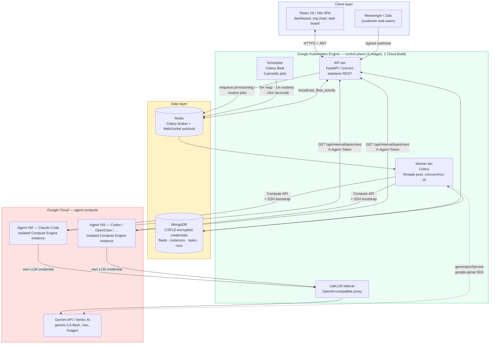
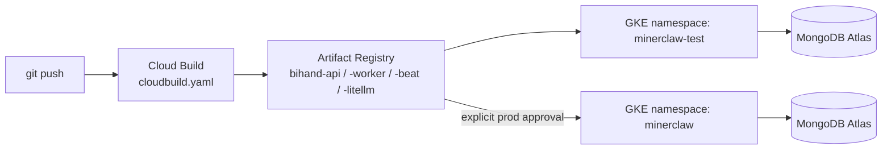

# Architecture

Bihand is a stateless, event-driven control plane: a FastAPI REST API and a Celery
worker/beat pair, coordinating over MongoDB and Redis, that provisions and supervises
fleets of autonomous AI agents running as isolated GCP Compute VMs. Agents never talk to
the browser or to each other directly — every interaction is mediated through the API,
so the database is always the single source of truth for what an agent is doing and why.

## System diagram

## The three loops that matter

**1. Fleet provisioning (human → agent, cold start).**
A user designs an org chart in the wizard and submits it. The API validates the request
and enqueues a job on Redis; a Celery worker calls the GCP Compute API to create one VM
per agent, injects a bootstrap script via VM metadata (the `services/provisioning/*`
strategy for that agent's runtime — Claude Code, Codex, OpenClaw, OpenCode, Hermes, or
NemoClaw), and writes the encrypted connection details back to MongoDB. The VM installs
its agent runtime, mints its own dashboard token, and starts polling.

**2. Task execution (agent ⇄ agent, steady state).**
An agent VM calls `GET /api/internal/tasks/next` with its `X-Agent-Token`, which the API
resolves against the `dashboardToken` stored on its `instances` document — no user
credential is ever present on the VM. The agent works the task using its *own* LLM
credential (BYOK, resolved from `credentialController` at provisioning time, or the
built-in `bihand`-provider path that routes through the LiteLLM sidecar and is metered
against `users.credits`), then reports back via `PATCH /api/internal/tasks/{id}/status`.
Every status change fans out over the Redis-backed WebSocket layer, so the dashboard
updates live without polling.

**3. Customer support (external event → agent, asynchronous).**
An inbound Messenger/Zalo message hits a public, signature-verified webhook
(`channelWebhookController`). It's attached to a durable `Conversation` /
`CustomerProfile` record, debounced, and handed to an agent for a drafted or
auto-sent reply depending on the flow's policy — the same "durable state + async
agent action" shape as the task loop, applied to real-time external messages instead of
an internal task board.

## Deployment topology

One repo, four Dockerfiles (`Dockerfile.api`, `.worker`, `.beat`, `.litellm`), one
`cloudbuild.yaml` that builds and pushes all four on every deploy. Locally, the same
four processes run from a single `docker-compose.test.yml` (plus a bundled `mongo`
and `redis` container, so local dev needs no cloud account at all) — the only thing
that changes between "run it on my laptop" and "run it on GKE" is where `MONGODB_URI`
and `REDIS_URL` point.

## Security model at a glance

- **Three separate auth schemes, none of them shared**: JWT for human dashboard
  sessions, `X-Agent-Token` (opaque, per-instance, DB-resolved) for agent M2M calls, and
  HMAC webhook-signature verification for inbound Messenger/Zalo events.
- **CSFLE, not application-level encryption bolted on**: provider API keys and OAuth
  tokens are encrypted client-side (`AEAD_AES_256_CBC_HMAC_SHA_512`) before they ever
  reach MongoDB's wire protocol — a DB dump or a compromised read replica exposes
  ciphertext, not secrets.
- **Short-lived tokens for third-party access**: Google Workspace scopes are proxied
  per-request (`GET /api/internal/google/token`); the long-lived refresh token stays in
  the encrypted database and never touches agent-VM disk.
- **Config-driven admin, not a code-level backdoor**: the admin allowlist is `ADMIN_USER`
  from the environment — nothing is hardcoded into the source.
