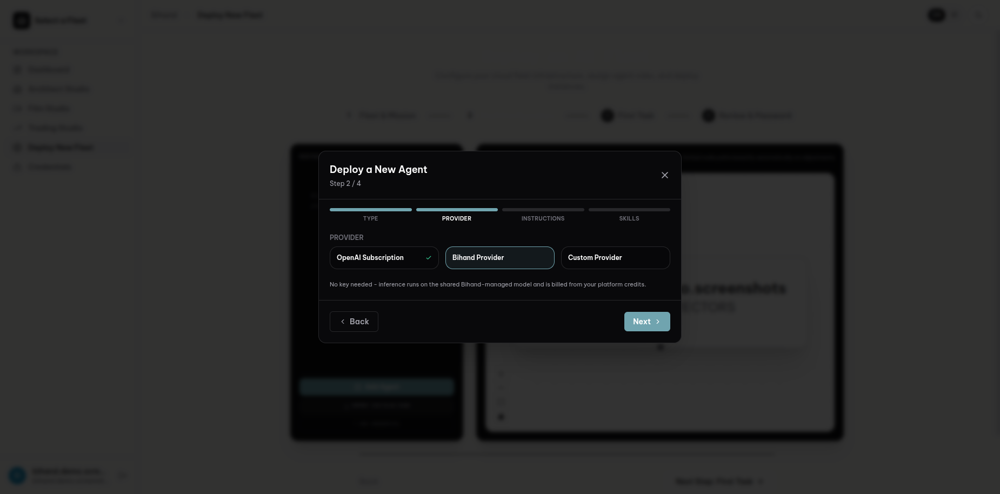
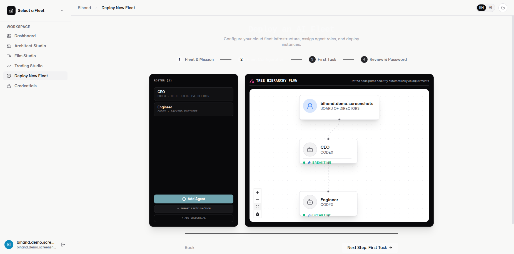
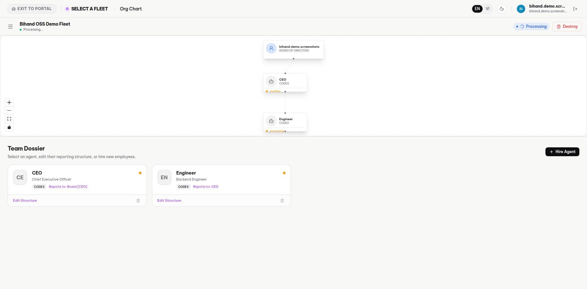
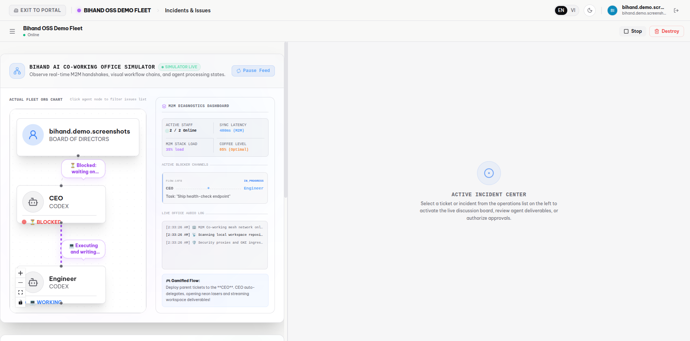
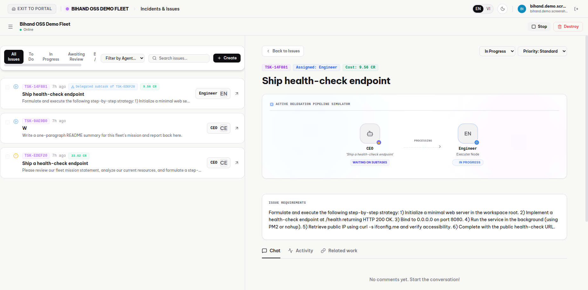
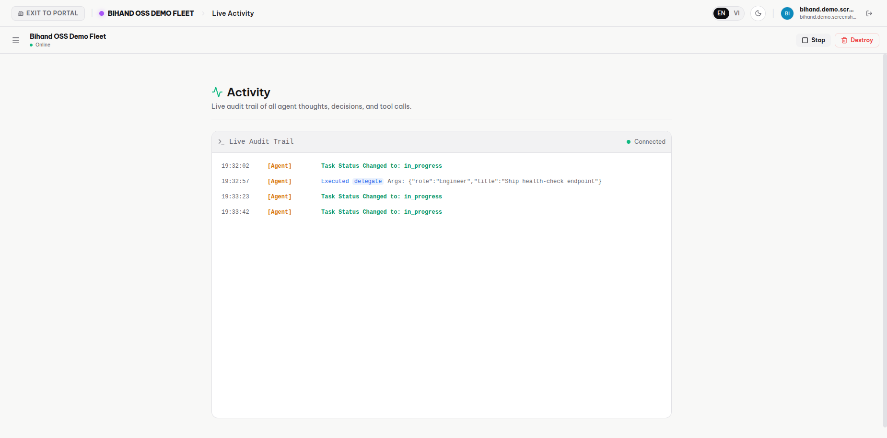

# Bihand — an AI Company Control Plane

**Bihand** provisions and runs *fleets* of autonomous AI agents — CEO, CTO, engineer, support-rep, and more — as long-lived, cross-session "employees" inside isolated cloud workspaces, and gives a human org chart, task board, and audit trail to manage them by. It is a FastAPI + MongoDB + Celery control plane paired with a React dashboard.

> This is a secrets-stripped, standalone open-source release of a larger private codebase. **No Google account and no billing/credit system are required to use it** — log in with email + password, bring your own GCP project and LLM API key, and pay those providers directly; nothing here meters or gates on a credit balance. See [`ROADMAP.md`](./ROADMAP.md) for the maintainer's longer-term plan to grow this into a fully self-hostable community project — not yet executed, included to show the engineering thinking behind the architecture.

---

## Screenshots

Captured on this repo's own live deployment against a real fleet — two Codex agents
(CEO → Engineer) on the Bihand Provider, real GCP VMs, real autonomous delegation.
Nothing below is a mockup. Full set with captions in
[`docs/screenshots/`](./docs/screenshots/README.md).

| | |
|---|---|
|  Deploy wizard — Codex runtime, Bihand Provider (no key needed) |  Org chart — Board → CEO → Engineer |
|  Fleet control plane — real GCP VM states, live |  CEO agent autonomously delegating to the Engineer |
|  Task detail — the delegation pipeline and full subtask spec |  Live audit trail — the actual `delegate` M2M tool call |

---

## Enterprise-fleet security model

Bihand is built for institutional use: a scalable network of agents that are cataloged for cross-department use, that safely maintain context across weeks of asynchronous operation, and that touch production data without violating enterprise security or compliance. That's not a bolt-on — it's the core data model:

| Capability | How Bihand does it |
|---|---|
| **Agent Registry** — cataloging agents for cross-department use | Every agent is a document in `fleets`/`instances`, positioned on an org chart (`fleetModel`) with a role (CEO/CTO/worker/…), a runtime type, and a `reportsTo` chain — the whole roster is queryable and importable/exportable via CSV. |
| **Agent Runtime** — long-running, async background execution | Agents run as full VMs/containers polling their own task queue (`agentM2MController`), not request/response chat turns; a task can sit `in_progress` for hours across multiple agent "shifts." |
| **Memory Bank** — persistent, secure cross-session context | Task/goal/routine/comment state lives in MongoDB, not the agent's context window — an agent that restarts (or a *different* agent that picks up the task) resumes from durable state, not a lost chat history. |
| **Agent Identity** — zero-trust access control | Agents never hold user credentials. Each gets a per-instance `dashboardToken`, checked via `X-Agent-Token` on every M2M call (`agentM2MController`) — a compromised agent VM can only act as itself, on its own tasks. |
| **Security & Governance** | Provider API keys and OAuth tokens are protected with **Client-Side Field Level Encryption** (`AEAD_AES_256_CBC_HMAC_SHA_512`, `pymongocrypt`) — even a database dump doesn't expose them. Admin access is a config-driven allowlist, not a code-level backdoor. |
| **Telemetry / Observability** | A WebSocket activity stream (`websocketController.broadcast_fleet_activity`) plus a `runs`/`activity` audit trail give a live and historical record of what every agent did, when, and on whose authority. |
| **Production data, safely** | Google Workspace access for agents goes through short-lived OAuth tokens minted per-request (`GET /api/internal/google/token`) — refresh tokens never touch agent-VM disk. |

---

## Google Cloud & Gemini integration

- **Gemini** — the built-in LLM billing proxy (`fastapp/controllers/llmController.py`) force-maps every request to **`gemini-3.5-flash`** via the Gemini API; the Architecture Studio and Film Studio verticals call Gemini image/video models (`gemini-2.5-flash-image`, `veo-3.1-*`) directly, and Trading Studio's sandboxed agent calls Gemini for structured generation and tool-calling chat through its own metered proxy endpoints (`fastapp/controllers/sandboxController.py`).
- **Google GenAI SDK** — `google-genai` (the official Python GenAI SDK, `from google import genai`) is used throughout `fastapp/services/generationService.py`, `fastapp/utils/utils.py`, and `fastapp/tasks.py` for both the Gemini API and Vertex AI code paths.
- **Google Cloud infrastructure** — deployed as four containers on **GKE** (Uvicorn API, Celery worker, Celery beat, LiteLLM sidecar — see `cloudbuild.yaml`, `Dockerfile.api/.worker/.beat/.litellm`), built via **Cloud Build** and pushed to **Artifact Registry**; agent workloads themselves run as isolated **Compute Engine** VMs (`fastapp/services/gcpService.py`). A fifth image, `Dockerfile.sandbox`, runs LLM-generated Trading Studio strategies on a zero-IAM-role **Cloud Run Job** instead of GKE — see ARCHITECTURE.md's security model.

---

## Architecture

See [`ARCHITECTURE.md`](./ARCHITECTURE.md) for the full diagram and write-up. Short version:

```
React SPA  ──HTTPS──▶  FastAPI (Uvicorn, stateless)  ──▶  MongoDB (CSFLE)
                              │        ▲
                          enqueue    X-Agent-Token
                              ▼        │
                         Redis  ◀──▶  Celery worker/beat
                                          │
                                   GCP Compute API / SSH
                                          ▼
                              Agent VM (Claude Code / Codex / OpenClaw / …)
                                  polls GET /api/internal/tasks/next
                                  calls its own LLM key (Gemini, via LiteLLM)
```

- **API tier** (`fastapp/`, FastAPI): stateless REST API; DB init/migrations run as a non-blocking background task so the readiness probe never times out.
- **Database**: MongoDB with Client-Side Field Level Encryption for credentials.
- **Broker**: Redis, shared by Celery and the WebSocket layer.
- **Worker tier**: Celery — GCP Compute calls, SSH into VMs, agent bootstrap, workspace sync, state reconciliation.
- **Scheduler**: Celery Beat — idle/expired-instance reaper, cron-scheduled routine evaluator, stuck-fleet/task healer.
- **Agent tier**: one of 7 provisioning strategies (`fastapp/services/provisioning/`) per agent runtime (Claude Code, Codex, OpenClaw, OpenCode, Hermes, NemoClaw), each installing and supervising its runtime inside an isolated GCP VM.

---

## Tech stack

**Backend** — Python 3.12, FastAPI/Uvicorn, MongoDB (`pymongo` + `pymongocrypt` CSFLE), Celery + Redis, `google-genai` (Gemini/Vertex AI), Google Cloud Compute SDK, paramiko (SSH), PyJWT, bcrypt.
**Frontend** — React 19, TypeScript, Vite, TailwindCSS, React Router 7.
**Infra** — Docker, Kubernetes (GKE), Cloud Build, Artifact Registry.

---

## Getting started (local)

Zero cloud account is required to boot the control plane itself — MongoDB and Redis both run as local containers, and logging in is a plain email/password form (no Google OAuth app to register, no consent screen). You only need a Gemini API key (free, from [aistudio.google.com](https://aistudio.google.com/apikey)) so agents have an LLM to call, and a GCP project only if you want to provision *real* agent VMs rather than just exercise the API/dashboard. **There is no billing or credit system in this build** — every action is BYOK; you pay Google Cloud and your LLM provider directly, not this platform.

### 1. Configure environment

```bash
cp .env.template .env                       # repo root — fills GEMINI_API_KEY for docker compose
cp fastapp/.env.example fastapp/.env         # app config — fill in the two generated secrets:
python3 -c "import secrets,base64; print(base64.b64encode(secrets.token_bytes(96)).decode())"   # -> MONGO_KEY
python3 -c "import secrets; print(secrets.token_urlsafe(48))"                                     # -> JWT_SECRET_KEY
```

Edit `.env` (repo root) and set `GEMINI_API_KEY`. Edit `fastapp/.env` and paste in the two generated values for `MONGO_KEY` and `JWT_SECRET_KEY`.

⚠️ **`MONGO_KEY` is the CSFLE master key.** Generate it once and keep it — losing it makes every stored credential permanently unreadable. Never regenerate it against an existing database.

### 2. Run the backend stack

```bash
docker compose -f docker-compose.test.yml up --build
```

This brings up MongoDB, Redis, the LiteLLM/Gemini sidecar, the FastAPI API (`:8501`), a Celery worker, and Celery beat. API docs: `http://localhost:8501/docs`.

### 3. Run the frontend

```bash
cd frontend
npm install
npm run dev        # http://localhost:5173
```

### 4. Log in

Open `http://localhost:5173` and sign up with any email + password — there's no Google account or invite needed. (If you'd rather sign in with Google, set `GOOGLE_CLIENT_ID`/`GOOGLE_CLIENT_SECRET` in `fastapp/.env` and `VITE_GOOGLE_CLIENT_ID` for the frontend build; the login page shows a Google button automatically once `GET /api/auth/config` reports it configured. It's entirely optional.) To make your account an admin, set `ADMIN_USER=you@example.com` in `fastapp/.env` before your first login.

### 5. GCP-backed agent provisioning (optional)

To actually spin up agent VMs rather than just explore the dashboard/API, add a credential for your LLM provider in the Credentials page, and set in `fastapp/.env`: `GOOGLE_CLOUD_PROJECT_ID`, `GCP_REGION`, `GCP_DEFAULT_ZONE`, and point `GOOGLE_APPLICATION_CREDENTIALS` at your own GCP service-account JSON with the Compute Engine API enabled. There is no credit/billing gate in front of this — GCP bills your own project directly.

**Two GCP project-setup steps are easy to miss and will otherwise cost you real debugging time** — a fresh project has neither by default: the service account needs Compute Engine IAM (`roles/compute.instanceAdmin.v1`), and GCP's auto-created `default` network — not whatever VPC your own control plane runs on; agent VMs land there regardless, it's hardcoded — needs a firewall rule for the tags agent VMs get created with, or provisioning will 403 immediately or silently wedge in `installing`. See **[`DEPLOYMENT.md`](./DEPLOYMENT.md)** for the exact commands and the failure signatures to recognize each by.

### Deploying beyond your laptop

This repo's own test/prod deployment runs the same four images (`cloudbuild.yaml`) on **GKE**. **[`DEPLOYMENT.md`](./DEPLOYMENT.md)** is the full guide — building/pushing images, the GCP IAM/firewall setup above, and ready-to-adapt manifests in `deploy/k8s/` for the whole stack (API, worker, beat, Redis, the LiteLLM sidecar, ingress).

### Production build / lint

```bash
cd frontend && npm run lint && npm run build   # tsc -b && vite build -> frontend/dist, served by FastAPI
```

---

## Usage guide

A walkthrough of what's actually behind the screenshots above — every step below was
run for real against this repo's own live deployment, in this order.

**1. Deploy a fleet.** From the dashboard, click **Deploy New Fleet** and give it a
name and mission statement — this becomes the founding charter every agent in the
fleet works from.

**2. Build the org chart.** Add agents one at a time: pick a runtime (Claude Code,
Codex, OpenClaw, OpenCode, …), a role and reporting line, and a provider for its LLM
calls. **Bihand Provider** needs no key at all — it's the shared, unmetered
model this build routes through the LiteLLM sidecar (see
[`02-wizard-codex-bihand-provider.png`](./docs/screenshots/02-wizard-codex-bihand-provider.png));
picking OpenAI/Anthropic/Custom instead asks for that provider's own credential.
Each agent you add attaches to the tree — a CEO reporting to you, an Engineer
reporting to the CEO, and so on
([`03-wizard-org-chart-hierarchy.png`](./docs/screenshots/03-wizard-org-chart-hierarchy.png)).

**3. Queue a first task (optional).** Give the top-level agent something to start on
the moment it comes online, so there's real work waiting instead of an idle fleet
([`04-wizard-first-task.png`](./docs/screenshots/04-wizard-first-task.png)).

**4. Review and launch.** The final step totals the roster and estimated GCP compute
cost, and confirms there's no billing gate in this build before you provision
([`05-wizard-review-and-launch.png`](./docs/screenshots/05-wizard-review-and-launch.png)).
Set a master dashboard password (used for the agents' VNC streams) and click
**Provision & Launch** — this is the point a real GCP Compute VM gets created per agent.

**5. Watch it come online.** The fleet control plane's navigation covers Org &
Roster, the Ops Board, Governance, Automations, a live feed, cost ledger, and
credential vault
([`06-control-plane-navigation.png`](./docs/screenshots/06-control-plane-navigation.png)).
The org chart updates live as each VM moves through real provisioning states —
`provisioning` → `installing` → `running`
([`07-org-chart-provisioning.png`](./docs/screenshots/07-org-chart-provisioning.png)) —
and the Ops Board's M2M diagnostics panel tracks active staff, sync latency, and a
live office audio log the whole time
([`08-ops-board-m2m-diagnostics.png`](./docs/screenshots/08-ops-board-m2m-diagnostics.png)).
Once every agent reports `running`, the fleet shows **Online** with every agent idle
and polling for work
([`09-fleet-online-agents-active.png`](./docs/screenshots/09-fleet-online-agents-active.png)).

**6. Give it work.** Type an instruction into the Ops Board's command prompter and
dispatch it — auto-assign routes it to the top-level agent, or target a specific one.
Within moments the agent picks it up and starts executing autonomously
([`10-agent-autonomously-working.png`](./docs/screenshots/10-agent-autonomously-working.png)).

**7. Watch it delegate.** A manager agent that decides a task needs a specialist
calls the same `delegate` M2M tool a human never has to touch — the parent task goes
`blocked` waiting on the subtask it just created, while the assignee starts working it
([`11-live-task-delegation.png`](./docs/screenshots/11-live-task-delegation.png)).
Opening the task shows the full delegation pipeline and the exact requirements the
manager handed down
([`12-delegation-pipeline-detail.png`](./docs/screenshots/12-delegation-pipeline-detail.png)).

**8. Audit everything.** The Live Feed is a real-time, append-only trail of every
agent decision and tool call — including the literal `delegate` invocation and its
arguments, not a paraphrase of one
([`13-live-activity-audit-trail.png`](./docs/screenshots/13-live-activity-audit-trail.png)).

**9. Back at the portal.** The top-level dashboard lists every fleet you run, its
daily compute cost, and total active agents across all of them
([`14-portal-dashboard.png`](./docs/screenshots/14-portal-dashboard.png)) — the
starting point for deploying the next one.

---

## Core workflows

**Fleet provisioning** (`fleetModel` + `services/provisioning/`): a user defines an org chart and clicks deploy → the API validates and enqueues via Redis → a Celery worker creates a GCP Compute instance per agent, injects a bootstrap script via VM metadata (installs the chosen agent runtime — Claude Code, Codex, OpenClaw, …), and writes the encrypted connection details back to MongoDB.

**Instance lifecycle**: `provisioning_queued → provisioning → installing → running → stopping_queued → stopped → deleting → deleted`, with a parallel `error`/`updating` path. A Celery Beat job runs every 5 minutes to detect and refund instances stuck mid-provision.

**Task execution (the M2M loop)**: an agent VM calls `GET /api/internal/tasks/next` with its `X-Agent-Token`, atomically checks out a task, works it, and reports status via `PATCH /api/internal/tasks/{id}/status` — the same 8-state task machine (`backlog → todo → in_progress → in_review/blocked/failed → done`) that the human dashboard uses, so a human and an agent can hand a task back and forth.

**Customer support pipeline** (`channelWebhookController`): inbound Messenger/Zalo messages hit a public, signature-verified webhook, get attached to a durable `Conversation`/`CustomerProfile` record, and are debounced into an agent-drafted (or auto-sent, per flow policy) reply — a second, independent example of the same "agent acts asynchronously on durable state" pattern, applied to real-time customer messages instead of task-board tickets.

**Trading Studio** (`tradingStudioController` + `sandboxController`): a free-text prompt ("backtest a MACD crossover on Tesla") becomes a task dispatched to a Cloud Run Job with no server credential of its own. The job runs the whole agent flow — interpret the prompt, fetch market data, generate and execute a `signal_engine.py`, analyse the result — and calls back into two token-authenticated endpoints for every LLM call and the final artifacts. A third, more adversarial example of the same durable-task pattern: here the "agent" is untrusted code the LLM itself wrote.

**Security**: CSFLE for every stored provider key/OAuth token; per-agent M2M tokens instead of shared credentials; short-lived Google OAuth token minting so refresh tokens never reach agent-VM disk; a config-driven (not hardcoded) admin allowlist.

---

## Codebase structure

```
fastapp/
  controllers/     FastAPI routers — one per domain (auth, fleet, work, agentM2M, credential, ...)
  models/          Thin static-method wrappers over MongoDB collections (no ORM)
  services/        gcpService (Compute SDK), sshService (paramiko), provisionerService, agentProfileService
  services/provisioning/   One BaseProvisioningStrategy subclass per agent runtime
  utils/           mcp_normalizer, jwtUtils, adminAuth, socialUtils, systemPrompt
  migrations/      Declarative, lock-gated schema/VM migration runner
frontend/
  src/pages/       Dashboard, fleet workspace, Architecture/Film/Trading Studio, admin, login/register
  src/components/  Layout, org chart, landing page, trading charts
docker-compose.test.yml   Local dev stack: mongo, redis, litellm, api, worker, beat
Dockerfile.api / .worker / .beat / .litellm   The four images deployed to GKE
Dockerfile.sandbox        Trading Studio's LLM-code sandbox — a Cloud Run Job, not GKE
sandbox/, src/, backtest/ The sandboxed agent + backtest engine (vendored/adapted from
                          Vibe-Trading, MIT) that Dockerfile.sandbox packages
cloudbuild.yaml           Cloud Build pipeline → Artifact Registry
deploy/k8s/               GKE manifests (namespace, config/secret, redis, litellm, api, worker, beat, ingress)
DEPLOYMENT.md             Full deployment guide — local and GKE, including GCP IAM/firewall setup + troubleshooting
ARCHITECTURE.md           Full architecture diagram + write-up
ROADMAP.md                Maintainer's plan for a fuller community open-source release
```

---

## What's intentionally left out of this release

This is a slimmed-down copy of a larger private codebase. Removed for this release (not because they're broken, but because they're out of scope, add friction a self-hoster shouldn't have to deal with, and/or depend on infrastructure not included here): all Stripe/credit-purchase billing (the credit *system* itself is also disabled — see below) and the 3D avatar / sticker-service integration (an external microservice this repo doesn't include — see [`ROADMAP.md`](./ROADMAP.md)). Real, working credentials, a live API key, an admin-email backdoor, and a default OAuth client ID that existed in the private repo have all been removed or replaced with operator-configured environment variables — see the git history of this repo for the (single, clean) commit this was prepared in.

Generic GKE manifests *are* included this time (`deploy/k8s/`, see [`DEPLOYMENT.md`](./DEPLOYMENT.md)) — the private repo's own Kubernetes manifests aren't (those reference infra specific to that deployment), but this snapshot ships adapt-and-apply ones instead of leaving self-hosters to write their own from scratch.

**No Google login, no credit gating.** The private codebase this was forked from required Google OAuth to sign in at all, and gated every provisioning action behind a Stripe-purchased credit balance. Neither survives in this build: sign-in defaults to a plain email/password form (`POST /api/auth/register` / `/login`, bcrypt-hashed, JWT-issued — Google stays available as an *optional* extra if you configure `GOOGLE_CLIENT_ID`), and every credit/balance check in `instanceController.py`, `fleetController.py`, `architectureController.py`, and `filmStudioController.py` has been removed (`UserModel._deductCredits` is now a no-op). Clone it, add your own GCP project and LLM key, and go — nothing here asks you to pay this platform for anything.

---

## License

Apache License 2.0 — see [`LICENSE`](./LICENSE).
